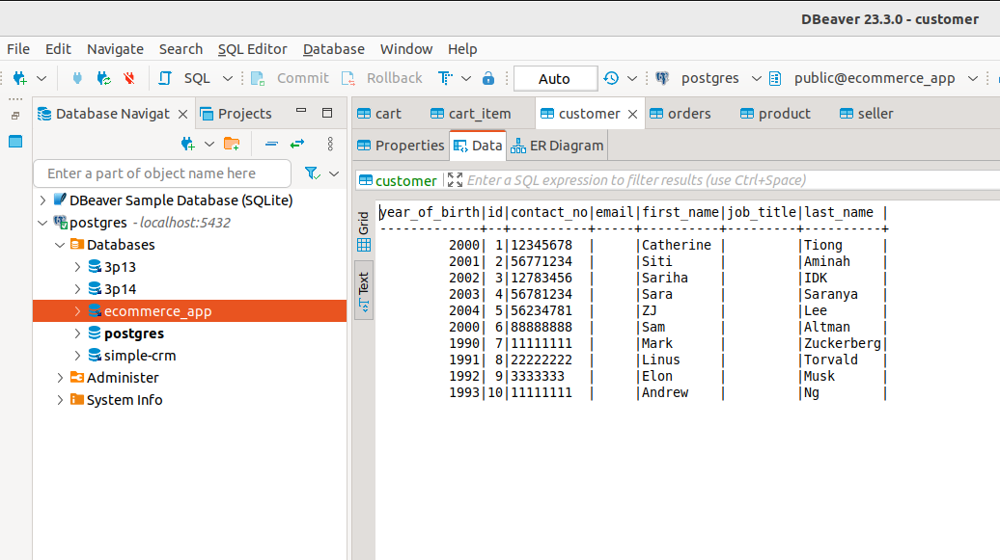
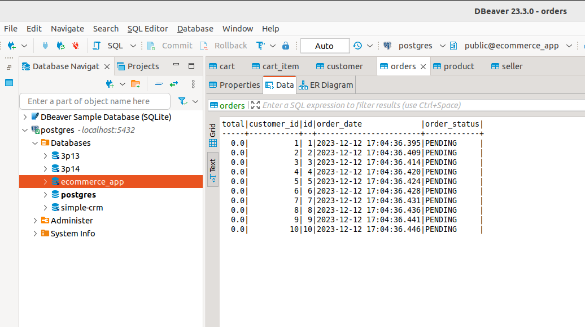
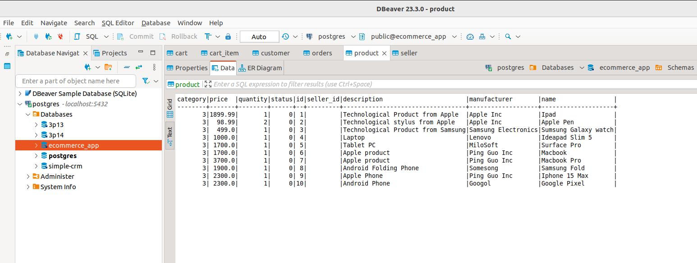

## 1 Get All Orders

http://localhost:8080/orders

Response

```
[
  {
    "orderId": 1,
    "orderDate": "2023-12-12T09:04:36.395+00:00",
    "orderingCustomer": {
      "id": 1,
      "firstName": "Catherine",
      "lastName": "Tiong",
      "email": null,
      "contactNo": "12345678",
      "jobTitle": null,
      "yearOfBirth": 2000,
      "customerCart": null
    },
    "orderedItems": [
      {
        "id": 1,
        "product": {
          "id": 1,
          "name": "Ipad",
          "quantity": 1,
          "description": "Technological Product from Apple",
          "category": "ELECTRONICS",
          "status": "ACTIVE",
          "price": 1899.99,
          "manufacturer": "Apple Inc"
        },
        "cartItemQuantity": 11
      },
      {
        "id": 2,
        "product": {
          "id": 2,
          "name": "Apple Pen",
          "quantity": 2,
          "description": "Technological stylus from Apple",
          "category": "ELECTRONICS",
          "status": "ACTIVE",
          "price": 98.99,
          "manufacturer": "Apple Inc"
        },
        "cartItemQuantity": 22
      },
      {
        "id": 3,
        "product": {
          "id": 3,
          "name": "Sumsung Galaxy watch",
          "quantity": 1,
          "description": "Technological Product from Samsung",
          "category": "ELECTRONICS",
          "status": "ACTIVE",
          "price": 499.0,
          "manufacturer": "Samsung Electronics"
        },
        "cartItemQuantity": 33
      },
      {
        "id": 4,
        "product": {
          "id": 4,
          "name": "Ideapad Slim 5",
          "quantity": 1,
          "description": "Laptop",
          "category": "ELECTRONICS",
          "status": "ACTIVE",
          "price": 1000.0,
          "manufacturer": "Lenovo"
        },
        "cartItemQuantity": 44
      }
    ],
    "orderStatus": "PENDING",
    "total": 0.0
  },
  {
    "orderId": 2,
    "orderDate": "2023-12-12T09:04:36.409+00:00",
    "orderingCustomer": {
      "id": 2,
      "firstName": "Siti ",
      "lastName": "Aminah",
      "email": null,
      "contactNo": "56771234",
      "jobTitle": null,
      "yearOfBirth": 2001,
      "customerCart": null
    },
    "orderedItems": [
      {
        "id": 5,
        "product": {
          "id": 5,
          "name": "Surface Pro",
          "quantity": 1,
          "description": "Tablet PC",
          "category": "ELECTRONICS",
          "status": "ACTIVE",
          "price": 1700.0,
          "manufacturer": "MiloSoft"
        },
        "cartItemQuantity": 55
      },
      {
        "id": 6,
        "product": {
          "id": 6,
          "name": "Macbook",
          "quantity": 1,
          "description": "Apple product",
          "category": "ELECTRONICS",
          "status": "ACTIVE",
          "price": 1700.0,
          "manufacturer": "Ping Guo Inc"
        },
        "cartItemQuantity": 66
      },
      {
        "id": 7,
        "product": {
          "id": 7,
          "name": "Macbook Pro",
          "quantity": 1,
          "description": "Apple product",
          "category": "ELECTRONICS",
          "status": "ACTIVE",
          "price": 3700.0,
          "manufacturer": "Ping Guo Inc"
        },
        "cartItemQuantity": 77
      }
    ],
    "orderStatus": "PENDING",
    "total": 0.0
  },
  {
    "orderId": 3,
    "orderDate": "2023-12-12T09:04:36.414+00:00",
    "orderingCustomer": {
      "id": 3,
      "firstName": "Sariha",
      "lastName": "IDK",
      "email": null,
      "contactNo": "12783456",
      "jobTitle": null,
      "yearOfBirth": 2002,
      "customerCart": null
    },
    "orderedItems": [
      {
        "id": 8,
        "product": {
          "id": 8,
          "name": "Samsung Fold",
          "quantity": 1,
          "description": "Android Folding Phone",
          "category": "ELECTRONICS",
          "status": "ACTIVE",
          "price": 1900.0,
          "manufacturer": "Somesong"
        },
        "cartItemQuantity": 88
      },
      {
        "id": 9,
        "product": {
          "id": 9,
          "name": "Iphone 15 Max",
          "quantity": 1,
          "description": "Apple Phone",
          "category": "ELECTRONICS",
          "status": "ACTIVE",
          "price": 2300.0,
          "manufacturer": "Ping Guo Inc"
        },
        "cartItemQuantity": 99
      },
      {
        "id": 10,
        "product": {
          "id": 10,
          "name": "Google Pixel",
          "quantity": 1,
          "description": "Android Phone",
          "category": "ELECTRONICS",
          "status": "ACTIVE",
          "price": 2300.0,
          "manufacturer": "Googol"
        },
        "cartItemQuantity": 100
      }
    ],
    "orderStatus": "PENDING",
    "total": 0.0
  },
  {
    "orderId": 4,
    "orderDate": "2023-12-12T09:04:36.420+00:00",
    "orderingCustomer": {
      "id": 4,
      "firstName": "Sara",
      "lastName": "Saranya",
      "email": null,
      "contactNo": "56781234",
      "jobTitle": null,
      "yearOfBirth": 2003,
      "customerCart": null
    },
    "orderedItems": [],
    "orderStatus": "PENDING",
    "total": 0.0
  },
  {
    "orderId": 5,
    "orderDate": "2023-12-12T09:04:36.424+00:00",
    "orderingCustomer": {
      "id": 5,
      "firstName": "ZJ",
      "lastName": "Lee",
      "email": null,
      "contactNo": "56234781",
      "jobTitle": null,
      "yearOfBirth": 2004,
      "customerCart": null
    },
    "orderedItems": [],
    "orderStatus": "PENDING",
    "total": 0.0
  },
  {
    "orderId": 6,
    "orderDate": "2023-12-12T09:04:36.428+00:00",
    "orderingCustomer": {
      "id": 6,
      "firstName": "Sam",
      "lastName": "Altman",
      "email": null,
      "contactNo": "88888888",
      "jobTitle": null,
      "yearOfBirth": 2000,
      "customerCart": null
    },
    "orderedItems": [],
    "orderStatus": "PENDING",
    "total": 0.0
  },
  {
    "orderId": 7,
    "orderDate": "2023-12-12T09:04:36.431+00:00",
    "orderingCustomer": {
      "id": 7,
      "firstName": "Mark ",
      "lastName": "Zuckerberg",
      "email": null,
      "contactNo": "11111111",
      "jobTitle": null,
      "yearOfBirth": 1990,
      "customerCart": null
    },
    "orderedItems": [],
    "orderStatus": "PENDING",
    "total": 0.0
  },
  {
    "orderId": 8,
    "orderDate": "2023-12-12T09:04:36.436+00:00",
    "orderingCustomer": {
      "id": 8,
      "firstName": "Linus",
      "lastName": "Torvald",
      "email": null,
      "contactNo": "22222222",
      "jobTitle": null,
      "yearOfBirth": 1991,
      "customerCart": null
    },
    "orderedItems": [],
    "orderStatus": "PENDING",
    "total": 0.0
  },
  {
    "orderId": 9,
    "orderDate": "2023-12-12T09:04:36.441+00:00",
    "orderingCustomer": {
      "id": 9,
      "firstName": "Elon",
      "lastName": "Musk",
      "email": null,
      "contactNo": "3333333",
      "jobTitle": null,
      "yearOfBirth": 1992,
      "customerCart": null
    },
    "orderedItems": [],
    "orderStatus": "PENDING",
    "total": 0.0
  },
  {
    "orderId": 10,
    "orderDate": "2023-12-12T09:04:36.446+00:00",
    "orderingCustomer": {
      "id": 10,
      "firstName": "Andrew",
      "lastName": "Ng",
      "email": null,
      "contactNo": "11111111",
      "jobTitle": null,
      "yearOfBirth": 1993,
      "customerCart": null
    },
    "orderedItems": [],
    "orderStatus": "PENDING",
    "total": 0.0
  }
]
```
## 2 Get 1 order

http://localhost:8080/orders/{orderId}

Response
```
{
  "orderId": 1,
  "orderDate": "2023-12-12T09:04:36.395+00:00",
  "orderingCustomer": {
    "id": 1,
    "firstName": "Catherine",
    "lastName": "Tiong",
    "email": null,
    "contactNo": "12345678",
    "jobTitle": null,
    "yearOfBirth": 2000,
    "customerCart": null
  },
  "orderedItems": [
    {
      "id": 1,
      "product": {
        "id": 1,
        "name": "Ipad",
        "quantity": 1,
        "description": "Technological Product from Apple",
        "category": "ELECTRONICS",
        "status": "ACTIVE",
        "price": 1899.99,
        "manufacturer": "Apple Inc"
      },
      "cartItemQuantity": 11
    },
    {
      "id": 2,
      "product": {
        "id": 2,
        "name": "Apple Pen",
        "quantity": 2,
        "description": "Technological stylus from Apple",
        "category": "ELECTRONICS",
        "status": "ACTIVE",
        "price": 98.99,
        "manufacturer": "Apple Inc"
      },
      "cartItemQuantity": 22
    },
    {
      "id": 3,
      "product": {
        "id": 3,
        "name": "Sumsung Galaxy watch",
        "quantity": 1,
        "description": "Technological Product from Samsung",
        "category": "ELECTRONICS",
        "status": "ACTIVE",
        "price": 499.0,
        "manufacturer": "Samsung Electronics"
      },
      "cartItemQuantity": 33
    },
    {
      "id": 4,
      "product": {
        "id": 4,
        "name": "Ideapad Slim 5",
        "quantity": 1,
        "description": "Laptop",
        "category": "ELECTRONICS",
        "status": "ACTIVE",
        "price": 1000.0,
        "manufacturer": "Lenovo"
      },
      "cartItemQuantity": 44
    }
  ],
  "orderStatus": "PENDING",
  "total": 0.0
}
```
## 3 Create Order

Body

JSON CONTENT
{ "customerId":10}

Response
```
{
  "orderId": 11,
  "orderDate": "2023-12-12T09:11:09.751+00:00",
  "orderingCustomer": {
    "id": 10,
    "firstName": "Andrew",
    "lastName": "Ng",
    "email": null,
    "contactNo": "11111111",
    "jobTitle": null,
    "yearOfBirth": 1993,
    "customerCart": null
  },
  "orderedItems": [],
  "orderStatus": "PENDING",
  "total": 0.0
}
```
## 4 Get Cart Item

Response 
```
[
  {
    "id": 1,
    "product": {
      "id": 1,
      "name": "Ipad",
      "quantity": 1,
      "description": "Technological Product from Apple",
      "category": "ELECTRONICS",
      "status": "ACTIVE",
      "price": 1899.99,
      "manufacturer": "Apple Inc"
    },
    "cartItemQuantity": 11
  },
  {
    "id": 2,
    "product": {
      "id": 2,
      "name": "Apple Pen",
      "quantity": 2,
      "description": "Technological stylus from Apple",
      "category": "ELECTRONICS",
      "status": "ACTIVE",
      "price": 98.99,
      "manufacturer": "Apple Inc"
    },
    "cartItemQuantity": 22
  },
  {
    "id": 3,
    "product": {
      "id": 3,
      "name": "Sumsung Galaxy watch",
      "quantity": 1,
      "description": "Technological Product from Samsung",
      "category": "ELECTRONICS",
      "status": "ACTIVE",
      "price": 499.0,
      "manufacturer": "Samsung Electronics"
    },
    "cartItemQuantity": 33
  },
  {
    "id": 4,
    "product": {
      "id": 4,
      "name": "Ideapad Slim 5",
      "quantity": 1,
      "description": "Laptop",
      "category": "ELECTRONICS",
      "status": "ACTIVE",
      "price": 1000.0,
      "manufacturer": "Lenovo"
    },
    "cartItemQuantity": 44
  },
  {
    "id": 5,
    "product": {
      "id": 5,
      "name": "Surface Pro",
      "quantity": 1,
      "description": "Tablet PC",
      "category": "ELECTRONICS",
      "status": "ACTIVE",
      "price": 1700.0,
      "manufacturer": "MiloSoft"
    },
    "cartItemQuantity": 55
  },
  {
    "id": 6,
    "product": {
      "id": 6,
      "name": "Macbook",
      "quantity": 1,
      "description": "Apple product",
      "category": "ELECTRONICS",
      "status": "ACTIVE",
      "price": 1700.0,
      "manufacturer": "Ping Guo Inc"
    },
    "cartItemQuantity": 66
  },
  {
    "id": 7,
    "product": {
      "id": 7,
      "name": "Macbook Pro",
      "quantity": 1,
      "description": "Apple product",
      "category": "ELECTRONICS",
      "status": "ACTIVE",
      "price": 3700.0,
      "manufacturer": "Ping Guo Inc"
    },
    "cartItemQuantity": 77
  },
  {
    "id": 8,
    "product": {
      "id": 8,
      "name": "Samsung Fold",
      "quantity": 1,
      "description": "Android Folding Phone",
      "category": "ELECTRONICS",
      "status": "ACTIVE",
      "price": 1900.0,
      "manufacturer": "Somesong"
    },
    "cartItemQuantity": 88
  },
  {
    "id": 9,
    "product": {
      "id": 9,
      "name": "Iphone 15 Max",
      "quantity": 1,
      "description": "Apple Phone",
      "category": "ELECTRONICS",
      "status": "ACTIVE",
      "price": 2300.0,
      "manufacturer": "Ping Guo Inc"
    },
    "cartItemQuantity": 99
  },
  {
    "id": 10,
    "product": {
      "id": 10,
      "name": "Google Pixel",
      "quantity": 1,
      "description": "Android Phone",
      "category": "ELECTRONICS",
      "status": "ACTIVE",
      "price": 2300.0,
      "manufacturer": "Googol"
    },
    "cartItemQuantity": 100
  }
]
```
## 5 Get 1 Cart Item

http://localhost:8080/cartItems/{cartId}

Response
```
{
  "id": 5,
  "product": {
    "id": 5,
    "name": "Surface Pro",
    "quantity": 1,
    "description": "Tablet PC",
    "category": "ELECTRONICS",
    "status": "ACTIVE",
    "price": 1700.0,
    "manufacturer": "MiloSoft"
  },
  "cartItemQuantity": 55
}
```
## 6 Create Cart Item

http://localhost:8080/cartItems

Body

```
{
    "product": {
      "id": 1,
      "name": "Ipad",
      "quantity": 1,
      "description": "Technological Product from Apple",
      "category": "ELECTRONICS",
      "status": "ACTIVE",
      "price": 1899.99,
      "manufacturer": "Apple Inc"
    },
    "cartItemQuantity": 100
  }

```


Response
```
{
  "message": "Something went wrong",
  "timestamp": "2023-12-12T17:22:26.740183461"
}

Error
17:22:26.739 [http-nio-8080-exec-8] WARN  o.s.h.c.j.MappingJackson2HttpMessageConverter - Failed to evaluate Jackson deserialization for type [[simple type, class com.ntu.edu.group5.ecommerce.entity.CartItem]]: com.fasterxml.jackson.databind.exc.InvalidDefinitionException: Multiple back-reference properties with name 'defaultReference'

```

## DataBase

1) Cart Id


2) Customer





3) Orders




4) Products




