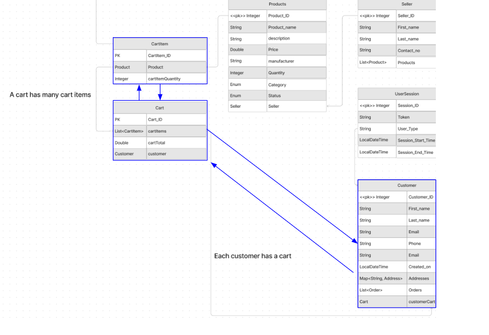
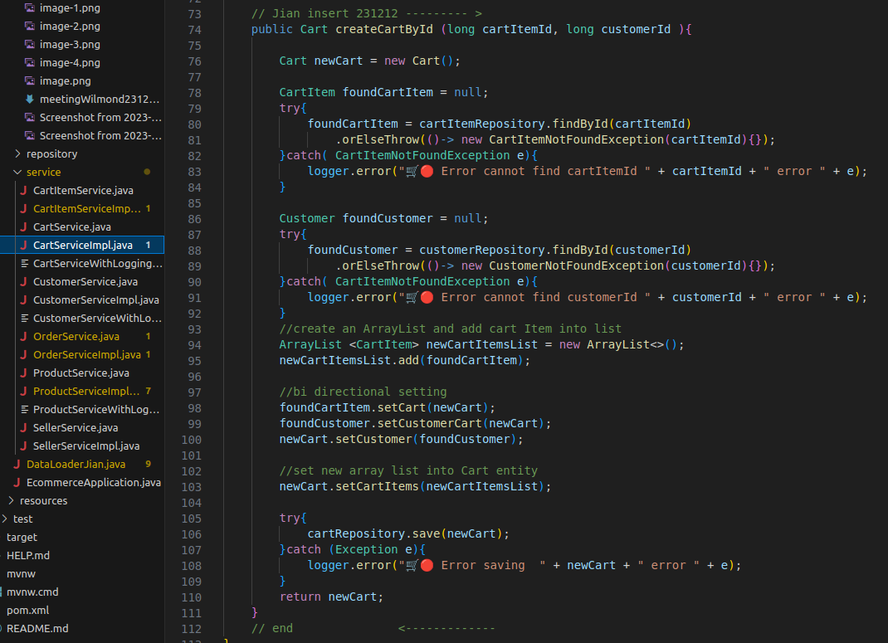

## ECOMMERCE APP

ERD DIAGRAM - credit goes to Catherine 


## Question - Managing Bi Directional Relationship

1) THe different type of Cascade types

- ALL
- DETACH (by changing to DETACH it seems that deleting order no longer deletes customer)
- MERGE
- mappedBy - rules of when to use - is the "owner" the @One side the one mapping?

2) Lazy loading Vs Eager Loading

3) Is it ok to have unidirectional relationship? In Cart Item i declare @OneToMany to customer , but in customer i do no @ManyToOne declaration.

4) How to manage the List inside the @One (owner side). Do we leave it to Springboot to manage or do we manually get the List, update it, set it back to the entity, and then save that entity to DB.


## Problem (Cannot link relationships)




1) Attempt 1 - setting relationship on one side

Code
```
 public Cart createCartById (long cartItemId, long customerId ){

        Cart newCart = new Cart();

        CartItem foundCartItem = null;
        try{
            foundCartItem = cartItemRepository.findById(cartItemId)
                .orElseThrow(()-> new CartItemNotFoundException(cartItemId){});
        }catch( CartItemNotFoundException e){
            logger.error("🛒🔴 Error cannot find cartItemId " + cartItemId + " error " + e);
        }

        Customer foundCustomer = null;
        try{
            foundCustomer = customerRepository.findById(customerId)
                .orElseThrow(()-> new CustomerNotFoundException(customerId){});
        }catch( CartItemNotFoundException e){
            logger.error("🛒🔴 Error cannot find customerId " + customerId + " error " + e);
        }

        foundCartItem.setCart(newCart);
        foundCustomer.setCustomerCart(newCart);

        try{
            cartRepository.save(newCart);
        }catch (Exception e){
            logger.error("🛒🔴 Error saving  " + newCart + " error " + e);
        }
        return newCart;
    }

```

Result:

```
Status: 200 OK
Size: 55 Bytes
Time: 9 ms
{
  "id": 1,
  "cartTotal": 0.0,
  "cartItems": [],
  "customer": null
}

```

1 entry inside DB


2) Attempt 2 - setting relationship on both sides




```
18:50:07.904 [main] ERROR c.n.e.g.e.service.CartServiceImpl - 🛒🔴 Error saving  com.ntu.edu.group5.ecommerce.entity.Cart@682270ff error org.springframework.dao.InvalidDataAccessApiUsageException: detached entity passed to persist: com.ntu.edu.group5.ecommerce.entity.CartItem
```


Response

```
Status: 200 OK
Size: 2 Bytes
Time: 70 ms

[]

```
DB has nothing


Entity - Cart


Entity - Cart Item


## Addition materials online
https://medium.com/@arijit83work/bidirectional-relationship-using-onetomany-manytoone-annotation-in-spring-boot-3b91980ca222

## More problems

When using the data loader this issue comes out alot. There seems to be a chicken and egg problem , i need to create a blank entity first seperately, then only start setting it to one another.

```
Caused by: org.hibernate.PersistentObjectException: detached entity passed to persist: com.ntu.edu.group5.ecommerce.entity.OrderDummyP
        at org.hibernate.event.internal.DefaultPersistEventListener.persist(DefaultPersistEventListener.java:88)
        at org.hibernate.event.internal.DefaultPersistEventListener.onPersist(DefaultPersistEventListener.java:77)
        at org.hibernate.event.service.internal.EventListenerGroupImpl.fireEventOnEachListener(EventListenerGroupImpl.java:138)
        at org.hibernate.internal.SessionImpl.firePersist(SessionImpl.java:797)
        at org.hibernate.internal.SessionImpl.persist(SessionImpl.java:745)
        at org.hibernate.engine.spi.CascadingActions$7.cascade(CascadingActions.java:290)
        at org.hibernate.engine.spi.CascadingActions$7.cascade(CascadingActions.java:280)
        at org.hibernate.engine.internal.Cascade.cascadeToOne(Cascade.java:518)
        at org.hibernate.engine.internal.Cascade.cascadeAssociation(Cascade.java:439)
        at org.hibernate.engine.internal.Cascade.cascadeProperty(Cascade.java:225)
```


##

go to cart, establish relationship with customer